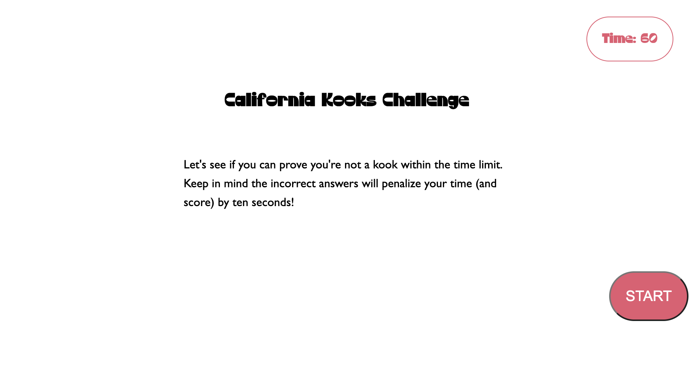

# California-Rocks-Quiz

Homework for UCSD bootcamp
Quiz Live Site: https://haleyhilton.github.io/California-Rocks-Quiz/

This project served to test knowledge surrounding 
. Creating an interactive quiz 
. Setting a timer that counts down and ends the quiz when hitting 0
. Saves highscores into localStorage

Intended functionality:
.You select the Start Quiz button and the game begins > you are presented with the first question > the time begins to count down
.Regardless if you get the answer correct or not, it moves onto the next question
.If you get the question wrong, you lose time 
.Once you complete the quiz, you're able to save your initials and your score

Wins and Opportunities: 
Started off by building out the HTML and CSS to create strong divs within the quiz. Then moved onto JS and jumped right into making variables and constants. Ultimately I think it would've been better to hit each section 1:1 rather than trying to build everything out at once. The reason being is, by building everything out all at once, I ran into the issue of how to make thinks hidden or visible and how to advanced to the next stage of the quiz when I'd already created the elements.

When you get to the landing page - you are met with a quiz title, brief description, start function and a static timer in the upper corner

From there you begin the quiz and can choose from an array of four answers. The timer begins to countdown in the upper right hand corner. If you select a wrong answer, 10 seconds will be deducted from your scoreIf you run out of time, you get an alert that lets you either stop or restart the game

If you get enough questions wrong - expect to run out of time and use the OK button to try your luck again!

Once you complete the game, you're met with a highscore page where you can enter in your initials which then get pushed to localStorage.

Final commit was possible through using additional code and only for my continued learning. Please refer to the prior commit for grading purposes.

